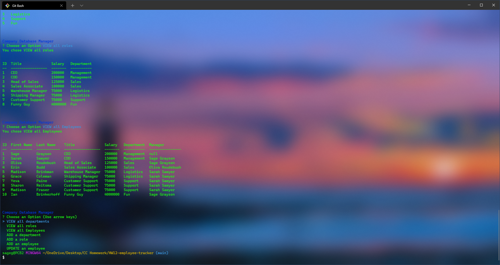

<!-- NOTES -->
<!-- Options

    VIEW
    all departments = department names and ids
    all roles = job title, role id, department name, salary
    all employees = employee id, first, last, job title, department name, salary, manager

    ADD
    a department = enter name
    a role = enter job title, salary, department
    an employee = enter first, last, job title, manager

    UPDATE
    an employee role = select employee, select new role

-->

# HW12 Employee Tracker
## Description

[Video Demo](https://watch.screencastify.com/v/0ZtvFotD8n9LRZbjA98m)

This application is used to create and maintain an employee database with departments, roles, and all aspects of an employee.
## Contents
- [Installation](#installation)
- [Usage](#usage)
- [Contributors](#contributors)
- [License](#license)
- [Contact](#contact)
## Installation
To install this project, clone the repository. Be sure to have node installed.
## Usage
To use this project, run "node index.js" in console.
## Contributors
Ian Brinkeroff

## License
The project uses the [Do WTF You Want To](http://www.wtfpl.net/) license.
## Contact
Link to my github: [sagegrayson](https://github.com/sagegrayson)

If you'd like to contact me, email me at [skaseyg@gmail.com](mailto:skaseyg@gmail.com)
